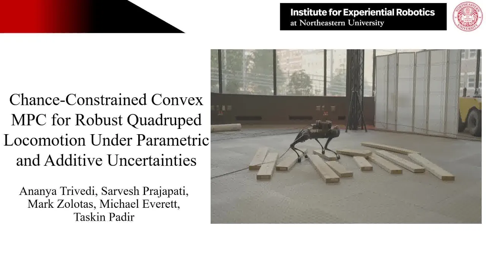

# Chance-Constrained Quadruped MPC
This repository contains the code and resources for the paper "Chance-Constrained Convex MPC for Robust Quadruped Locomotion Under Parametric and Additive Uncertainties". The robot's dynamics are modeled using a stochastic single rigid body dynamics framework, with inertial properties and contact locations represented as stochastic distributions. Uncertainty in the dynamics and control actions is propagated through Taylor series expansion. Friction cone and unilateral contact force constraints are adaptively tightened based on these propagated uncertainties. The key results demonstrate that with chance-constrained MPC, the robot achieves stable blind locomotion over challenging terrains and handles unmodeled payloads up to 7.5 kg effectively, outperforming Linear MPC and MPC with hand-tuned constraint tightening. Additional details can be found at the project [website](https://cc-mpc.github.io/)


### Video
For an overview of our method and results, please check out the supplementary video.
<p align="center">
    <a href="https://www.youtube.com/watch?v=hb4ZkGIjR7c&t=2s"></a>
</p>

## Experiments
Simulation and hardware experiments with an unmodeled 6kg payload.
<div style="text-align: center;">
  
  
</div>

#### Simulation Set-up
The parameters for all locomotion components have been organized separately from the core logic in ```controller_configs.py``` and ```world_configs.py```. To run a simulation with a specific set of parameters, follow these steps:

```bash
git clone git@github.com:RIVeR-Lab/Chance-Constrained-MPC.git
cd Chance-Constrained-MPC
python3 -m venv quadruped_venv
source quadruped_venv/bin/activate
pip3 install -r requirements.in
python3 setup.py install
python3 -m src.convex_mpc_controller.locomotion_controller
```
Some useful parameters are:
```bash
# File -- controller_configs.py
config.gait_type # Switch between gait types
config.constraint_tightening_method # Switch between MPC implementations
config.mpc_weights, config.mpc_control_weights # Weights for MPC trajectory tracking
config.Sigma_theta, config.Sigma_w #Covariance for Chance-Constrained MPC
config.dare_Q, config.dare_R #Weights for DARE solver to propagate control covariance
```

## Citation
If you find this code useful, please consider citing:

```bibtex
@article{trivedi2024chance,
  title={Chance-Constrained Convex MPC for Robust Quadruped Locomotion Under Parametric and Additive Uncertainties},
  author={Trivedi, Ananya and Prajapati, Sarvesh and Zolotas, Mark and Everett, Michael and Padir, Taskin},
  journal={arXiv preprint arXiv:2411.03481},
  year={2024}
}
